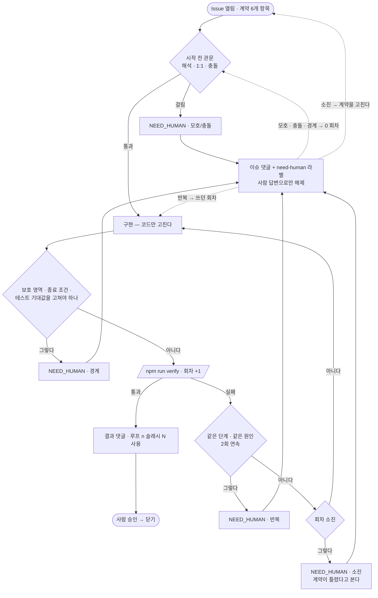
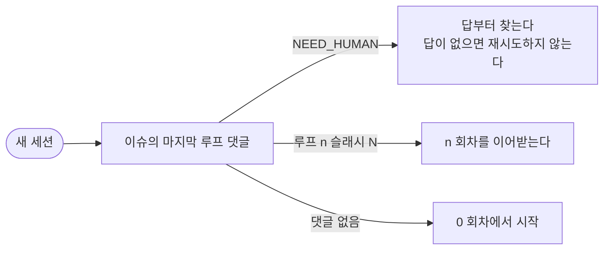

# 구현 루프

**한 줄:** 시작 전에 **종료 조건이 한 가지로 읽히는지** 보고, 고치고 `npm run verify` 를 돌리기까지가 1회.
한도 안에 못 끝내면 **계약을 의심하고** 사람에게 넘긴다.
책임 경계는 [ssot.md §7](ssot.md), 검증 자체는 [verification.md](verification.md).

---

## 핵심 규칙

1. **모호하면 시작하지 않는다.** 종료 조건이 두 갈래로 읽히면 첫 회차를 쓰기 전에 멈춘다.
2. **루프는 판정을 바꾸지 못한다.** 고칠 수 있는 것은 코드뿐이다.
3. **1회 = 고치고 `npm run verify` 를 돌리기까지.** 실행이 회차의 경계다.
4. **멈춤선에 걸리면 `NEED_HUMAN` 으로 넘긴다.** 셋 중 하나라도 해당되면 멈춘다.
5. **루프 상태는 이슈 댓글에 쓴다.** 세션에 두면 복구할 수 없다.
6. **회차를 셀 수 없으면 재시도하지 않는다.** 모르는 채로 두드리는 것이 가장 위험하다.

---

## 흐름



**세션이 끊기면** — 남는 것은 Issue 와 git 뿐이다. 회차는 댓글에서 복원한다 (§5).



---

## 1. 시작 전 관문

멈춤선은 전부 **"실패했을 때"** 작동한다. 그런데 종료 조건을 잘못 읽으면 그 해석대로 테스트를 쓰게 되어
**실패 없이 통과한다** — 횟수로는 원리적으로 못 잡는다. 그래서 첫 회차를 쓰기 전에 먼저 본다.

| 관문 | 기계적 판정 |
|---|---|
| **해석** | 종료 조건 한 줄에 참/거짓을 가를 테스트를 **한 가지로** 못 쓰면 모호 |
| **1:1** | 계약 3번(종료 조건) 줄과 4번(테스트 이름)이 1:1로 안 붙으면 모호 |
| **충돌** | 문서끼리 · Issue 와 SSOT 가 어긋나면 멈춤 ([ssot.md §4 · §5](ssot.md)) |

"헷갈린다"를 주관에 맡기지 않으려고 **"테스트를 한 가지로 쓸 수 있나"** 로 바꾼다.
두 개가 떠오르고 서로 결과가 다르면 그것이 모호의 정의다.

[ssot.md §4](ssot.md) 의 **"6개 항목이 비면 시작하지 않는다"** 와 같은 계열이다 —
빈 계약뿐 아니라 **두 갈래로 읽히는 계약**도 시작하지 못한다.

---

## 2. 세는 규칙

| 상황 | 셈 |
|---|---|
| 고치고 `npm run verify` 실행 | **1회** — 어느 단계에서 깨졌든 똑같이 1회 |
| 부분 실행 (`tsc` · `lint` · 단일 테스트) | 0회 — 같은 회차 안의 작업 |
| 통과한 뒤의 재실행 | 0회 — 통과로 루프는 이미 끝났다 |
| 코드를 안 고치고 재실행 | **즉시 멈춤** — 재현 안 되는 실패를 눈감는 것 |
| 요청이 바뀜 | 루프 아님. **새 계약** |

실패 종류로 나누지 않는 이유는 **회차가 관찰 가능해야** 하기 때문이다.
"이건 사소하니 안 센다"가 들어가면 판단이 끼어들고, 이어받는 세션이 회차를 다시 셀 수 없다.
verify 실행은 로그에 남는다 — 남는 것만 센다.

---

## 3. 멈춤선

| 선 | 조건 | 회차 |
|---|---|---|
| **반복** | 같은 단계 · 같은 원인 2회 연속 — 횟수가 남아도 멈춘다 | 쓴 만큼 |
| **총량** | 한도 소진 | 전부 |
| **경계** | 고칠 대상이 보호 영역 · 종료 조건 · 기존 테스트 기대값 | **0회차에도** |

경계선이 제일 중요하다. `--no-verify` · 테스트 기대값 수정 · 종료 조건 완화가 **하고 싶어지는 순간**이
곧 멈춤 신호다 ([verification.md §핵심 규칙 3](verification.md)).

**소진의 기본 해석은 "계약이 틀렸다"** 이다. 한도만큼 실패했다면 보통 종료 조건이 기계적으로 갈리지
않거나 배경이 틀렸다. 코드를 더 미는 것이 아니라 **계약을 고칠지 묻는다**.

---

## 4. NEED_HUMAN — 넘기는 방법

멈추는 모든 경우는 **하나의 토큰**으로 적는다. 산문으로 적으면 나중에 찾지 못한다.

`NEED_HUMAN · <이유> · 루프 n/N` — 이유는 다섯이고, 앞의 둘은 관문(§1), 뒤의 셋은 멈춤선(§3) 과 1:1 이다.

| 이유 | 어디서 | 회차 |
|---|---|---|
| **모호** | 관문 · 해석 · 1:1 | 0 |
| **충돌** | 관문 · 충돌 | 0 |
| **경계** | 멈춤선 · 경계 | 0 |
| **반복** | 멈춤선 · 반복 | 쓴 만큼 |
| **소진** | 멈춤선 · 총량 | 전부 |

### 발행 조건 — 둘 다 참일 때만

| 조건 | 판정 |
|---|---|
| ① 저장소 안에서 확인 **불가** | 코드 · 문서 · git 을 읽어 답이 나오면 **내가 찾는다** |
| ② 답에 따라 **결과물이 달라짐** | 어느 쪽이든 같은 코드가 나오면 그냥 진행한다 |

사람만 답할 수 있는 것 = **요청자의 의도 · 업무 규칙 · 우선순위**. 나머지는 에이전트의 일이다.

**금지 셋**
- 저장소를 안 읽고 던지기
- 답에 걸리지 않는 부분까지 멈추기 — **의존 없는 것은 다 해놓고** 던진다
- 질문 2개 이상 — 하나로 좁히지 못했다면 아직 이해가 덜 된 것이다

### 양식

```
NEED_HUMAN · 모호 · 루프 0/3
막힌 것: 종료 조건 3번 "재고가 모자라면 경고한다"
후보:  A · 입력 > 보유 → 경고   (tests/… > 보유 초과면 경고한다)
       B · 보유 0 → 경고        (tests/… > 재고 없으면 경고한다)
질문:  A 인가요 B 인가요
해둔 것: 1·2·4번 확정, 테스트 골격 작성까지
상태:  커밋 없음 · 작업 트리에 변경 있음
```

소진으로 멈출 때는 `후보` 자리에 **시도 전부와 각각 왜 실패했는지**를 적는다.

### 해제

- **사람의 댓글로만 풀린다.** 에이전트가 스스로 해제하지 않는다
- 모호 · 충돌 · 경계로 멈춘 것은 **회차 0 에서 다시 시작**한다 (실패가 아니라 시작을 안 한 것)
- 반복으로 멈춘 것은 사람이 원인을 짚어주면 **쓰던 회차에서 이어간다** — 예산은 이미 썼다
- 소진으로 멈춘 것은 사람이 계약을 고쳐야 재개된다 — 같은 계약으로 한도만 늘리지 않는다

### 라벨

발행할 때 `need-human` 라벨을 붙이고, 답을 읽고 재개할 때 뗀다
(`gh issue edit <n> --add-label need-human` / `--remove-label`).

**상태의 원본은 댓글이고 라벨은 색인이다.** 둘이 어긋나면 댓글이 이긴다 —
라벨은 `gh issue list --label need-human` 으로 대기 중인 작업을 한눈에 보기 위한 것뿐이다.

---

## 5. 세션이 끊겨도 이어받는다

세션은 언제든 끊긴다. 그때 남는 것은 **Issue 와 git 뿐**이다.

- 실패할 때마다 댓글 하나 — **회차를 첫 줄에 박는다**
- 새 세션은 **마지막 루프 댓글**을 먼저 읽는다
  - `NEED_HUMAN` 이면 → 회차를 이어받는 게 아니라 **답부터 찾는다**. 답이 없으면 재시도하지 않는다
  - 아니면 → 그 회차를 이어받는다. 댓글이 없으면 0 회차
- 커밋 여부와 작업 트리 상태를 반드시 적는다 — 다음 세션이 처음 확인할 것이다

```
루프 2/3 · Test 실패 · popup-plan-stock > 불변
시도: 반출서 저장 경로에서 applyMovement 호출 제거
다음: 종료 조건 "불변" 줄이 관찰값인지 확인
상태: 커밋 없음 · 작업 트리에 변경 있음
```

---

## 6. 한도

**전역 기본값 3회.** 작업별 한도는 각 Issue 계약 6번이 덮어쓴다 ([ssot.md §4](ssot.md)).

끝났을 때도 **쓴 횟수를 남긴다** (`루프 2/3 사용`).
한도가 사후에 검증 가능해지고, 어떤 종류의 작업이 몇 회를 먹는지가 쌓인다.
