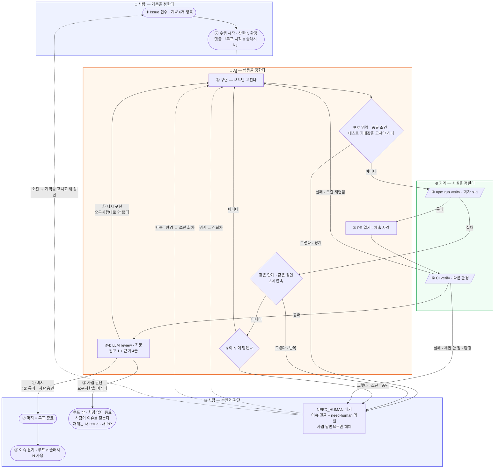
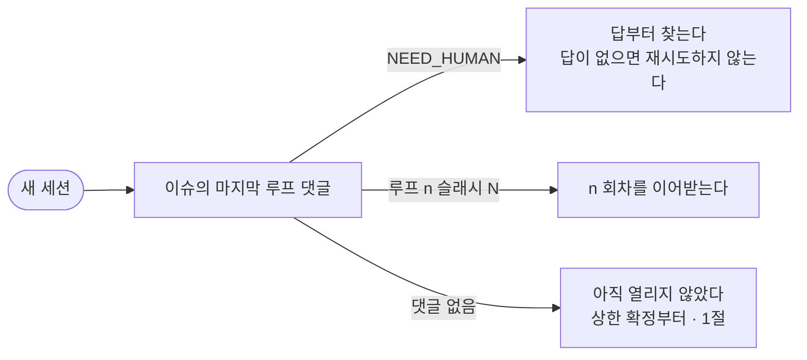

# 구현 루프

**한 줄:** 이슈를 수행하기 시작할 때 **그 이슈의 상한 N 을 확정**하고 연다.
고치고 `npm run verify` 를 돌리기까지가 1회, n 이 N 에 닿으면 **중단**하고 계약을 의심한다.
로컬 통과는 제출 자격일 뿐이고 **머지가 루프를 닫는다** (§6).
책임 경계는 [ssot.md §7](ssot.md), 검증 자체는 [verification.md](verification.md).

---

## 핵심 규칙

1. **루프는 이슈 하나에 하나다.** 수행을 시작할 때 그 이슈의 상한 N 을 확정하고 `n / N` 으로 연다.
   N 이 없으면 시작 자체를 안 한다.
2. **n 이 N 에 닿으면 중단한다.** 넘겨서 한 번 더 해보는 일은 없다.
3. **계약이 그대로면 차감하고, 계약이 바뀌면 루프가 끝난다.**
   못 맞춘 것은 AI 의 몫이고, 바꾼 것은 사람의 몫이다.
4. **루프는 판정을 바꾸지 못한다.** 고칠 수 있는 것은 코드뿐이다.
   로컬 통과는 종료가 아니라 **제출 자격**이고, **머지가 루프를 닫는다**.
5. **1회 = 고치고 `npm run verify` 를 돌리기까지.** 실행이 회차의 경계다.
6. **루프 상태는 이슈 댓글에 쓴다.** 세션에 두면 복구할 수 없다.
7. **회차를 셀 수 없으면 재시도하지 않는다.** 모르는 채로 두드리는 것이 가장 위험하다.

---

## 흐름



**세 영역이 정하는 것** — 사람은 **기준**(종료 조건 · 상한 · 승인), 기계는 **사실**(통과인가 아닌가),
AI 는 **행동**(무엇을 고치고 언제 넘길까). AI 가 기준을 건드리면 완료를 자기가 정의하는 것이고,
사실을 건드리면(`--no-verify` · CI 재실행) 판정을 자기가 하는 것이다.

**세션이 끊기면** — 남는 것은 Issue 와 git 뿐이다. `n / N` 은 댓글에서 복원한다 (§5).



---

## 1. 루프 시작 — 이슈를 수행할 때 상한을 확정한다

**루프는 이슈 하나에 하나다.** 접수만으로는 열리지 않는다 — **수행을 시작하는 순간** 그 이슈의
상한 N 을 확정하고 `n / N` 으로 연다. N 을 모르면 시작하지 않는다 — 셀 수 없는 루프는 멈출 줄도 모른다.

| 무엇 | 어디서 |
|---|---|
| 상한 N | 그 Issue 계약 **6번** ([ssot.md §4](ssot.md)) |
| 기본값 | **3회** — 6번이 비어 있을 때만 |
| 현재 회차 n | 그 이슈의 마지막 루프 댓글 (§5). 없으면 0 |

상한은 **이슈마다 따로** 갖는다. 다른 이슈의 잔여 회차를 끌어오지 않는다.
범위 밖을 고쳐야 해서 새 Issue 를 열면 ([ssot.md §4](ssot.md)) **새 루프에 새 상한**이다.

여는 순간 이슈에 댓글 하나를 남긴다 — 다음 세션이 회차를 복원할 기준점이 된다.

```
루프 시작 · 0/3
계약: 종료 조건 4줄 · 판정 npm run verify
```

**초과는 없다.** n 이 N 에 닿는 순간 다음 시도를 하지 않고 **중단**한다 (§3 총량).
`N+1` 번째를 "한 번만 더" 해보는 것은 한도를 없애는 것과 같다.

같은 계약으로 N 을 늘려 재개하지 않는다. **계약을 고치고 새 상한을 받는다.**

끝났을 때도 **쓴 횟수를 남긴다** (`루프 2/3 사용`) — 한도가 사후에 검증 가능해지고,
어떤 종류의 작업이 몇 회를 먹는지가 쌓인다.

---

## 2. 세는 규칙

| 상황 | 셈 |
|---|---|
| 고치고 `npm run verify` 실행 | **1회** — 어느 단계에서 깨졌든 똑같이 1회 |
| 부분 실행 (`tsc` · `lint` · 단일 테스트) | 0회 — 같은 회차 안의 작업 |
| 통과한 뒤의 재실행 | 0회 — 통과로 루프는 이미 끝났다 |
| 코드를 안 고치고 재실행 | **즉시 멈춤** — 재현 안 되는 실패를 눈감는 것 |
| **구현이 종료 조건을 못 맞춤** | **1회 차감** — AI 의 몫이다. 차감하고 다시 구현한다 |
| **사람이 요구사항을 바꿈** | **차감 없음 · 루프 종료** — 아래 §3-2 |

실패 종류로 나누지 않는 이유는 **회차가 관찰 가능해야** 하기 때문이다.
"이건 사소하니 안 센다"가 들어가면 판단이 끼어들고, 이어받는 세션이 회차를 다시 셀 수 없다.
verify 실행은 로그에 남는다 — 남는 것만 센다.

---

## 3. 멈춤선

| 선 | 조건 | 회차 |
|---|---|---|
| **반복** | 같은 단계 · 같은 원인 2회 연속 — 횟수가 남아도 멈춘다 | 쓴 만큼 |
| **총량** | 한도 소진 | 전부 |
| **경계** | 고칠 대상이 보호 영역 · 종료 조건 · 기존 테스트 기대값 | **0회차에도** |

경계선이 제일 중요하다. `--no-verify` · 테스트 기대값 수정 · 종료 조건 완화가 **하고 싶어지는 순간**이
곧 멈춤 신호다 ([verification.md §핵심 규칙 3](verification.md)).

**소진의 기본 해석은 "계약이 틀렸다"** 이다. 한도만큼 실패했다면 보통 종료 조건이 기계적으로 갈리지
않거나 배경이 틀렸다. 코드를 더 미는 것이 아니라 **계약을 고칠지 묻는다**.

**「경계」는 두 뜻이다** — 여기 멈춤선의 경계는 *고칠 대상이 보호 영역인 상황*이고,
종료 조건 4줄(정상 · **경계** · 거부 · 불변, [ssot.md §4](ssot.md))의 경계는 *엣지 케이스*다.
섞이지 않게 앞의 것을 가리킬 때는 **범위**라고 쓴다 (계약 5번 「건드리면 안 되는 것」, §6-b).

---

## 3-2. 요구사항이 바뀌면 루프는 끝난다

판정 기준은 **"계약이 그대로인가"** 하나다.

| | 누구의 몫 | 회차 |
|---|---|---|
| 계약은 그대로인데 구현이 못 맞췄다 | **AI** | **차감하고 다시 구현한다** |
| 사람이 계약을 바꿨다 | **사람** | **차감하지 않는다. 루프가 그 자리에서 끝난다** |

바뀐 뒤는 **루프 밖**이다. **사람이 그 이슈를 닫는다.**
**AI 는 재개하지 않는다** — 이어서 하려면 **새 Issue · 새 계약 · 새 상한 · 새 PR** 로 시작한다.
바뀐 요구사항을 같은 PR 에 얹으면 그 PR 이 무엇을 만족시켰는지 아무도 판정할 수 없다.

이 규칙이 없으면 요구사항이 흔들릴 때마다 AI 의 예산이 깎인다. 그러면 AI 는 요구사항 변경을
말리게 되고, 계약을 고쳐야 할 순간에 코드를 더 미는 쪽을 고르게 된다.

```
루프 종료 · 요구사항 변경 · 2/3 사용
바뀐 것: 종료 조건 3번 — "경고한다" → "저장을 막는다"
요청: 이 이슈를 닫아 주세요. 이어서 하려면 새 Issue 로 열어 주세요
상태: PR #12 · 머지하지 않음
```

---

## 4. NEED_HUMAN — 넘기는 방법

멈추는 모든 경우는 **하나의 토큰**으로 적는다. 산문으로 적으면 나중에 찾지 못한다.

`NEED_HUMAN · <이유> · 루프 n/N` — 여섯 가지다. 앞의 둘은 관문(부록), 뒤의 넷은 루프 안에서 난다.

| 이유 | 어디서 | 회차 |
|---|---|---|
| **모호** | 관문 · 해석 · 1:1 | 0 |
| **충돌** | 관문 · 충돌 | 0 |
| **경계** | 멈춤선 · 경계 | 0 |
| **반복** | 멈춤선 · 반복 | 쓴 만큼 |
| **환경** | CI 만 실패 · 로컬 재현 안 됨 (§6) | 쓴 만큼 |
| **소진** | 멈춤선 · 총량 | 전부 |

### 발행 조건 — 둘 다 참일 때만

| 조건 | 판정 |
|---|---|
| ① 저장소 안에서 확인 **불가** | 코드 · 문서 · git 을 읽어 답이 나오면 **내가 찾는다** |
| ② 답에 따라 **결과물이 달라짐** | 어느 쪽이든 같은 코드가 나오면 그냥 진행한다 |

사람만 답할 수 있는 것 = **요청자의 의도 · 업무 규칙 · 우선순위**. 나머지는 에이전트의 일이다.

**금지 셋**
- 저장소를 안 읽고 던지기
- 답에 걸리지 않는 부분까지 멈추기 — **의존 없는 것은 다 해놓고** 던진다
- 질문 2개 이상 — 하나로 좁히지 못했다면 아직 이해가 덜 된 것이다

### 양식

```
NEED_HUMAN · 모호 · 루프 0/3
막힌 것: 종료 조건 3번 "재고가 모자라면 경고한다"
후보:  A · 입력 > 보유 → 경고   (tests/… > 보유 초과면 경고한다)
       B · 보유 0 → 경고        (tests/… > 재고 없으면 경고한다)
질문:  A 인가요 B 인가요
해둔 것: 1·2·4번 확정, 테스트 골격 작성까지
상태:  커밋 없음 · 작업 트리에 변경 있음
```

소진으로 멈출 때는 `후보` 자리에 **시도 전부와 각각 왜 실패했는지**를 적는다.

### 해제

- **사람의 댓글로만 풀린다.** 에이전트가 스스로 해제하지 않는다
- 모호 · 충돌 · 경계로 멈춘 것은 **회차 0 에서 다시 시작**한다 (실패가 아니라 시작을 안 한 것)
- 반복 · 환경으로 멈춘 것은 사람이 원인을 짚어주면 **쓰던 회차에서 이어간다** — 예산은 이미 썼다
- 소진으로 멈춘 것은 사람이 계약을 고쳐야 재개된다 — 같은 계약으로 한도만 늘리지 않는다

### 라벨

발행할 때 `need-human` 라벨을 붙이고, 답을 읽고 재개할 때 뗀다
(`gh issue edit <n> --add-label need-human` / `--remove-label`).

**상태의 원본은 댓글이고 라벨은 색인이다.** 둘이 어긋나면 댓글이 이긴다 —
라벨은 `gh issue list --label need-human` 으로 대기 중인 작업을 한눈에 보기 위한 것뿐이다.

---

## 5. 세션이 끊겨도 이어받는다

세션은 언제든 끊긴다. 그때 남는 것은 **Issue 와 git 뿐**이다.

- 실패할 때마다 댓글 하나 — **회차를 첫 줄에 박는다**
- 새 세션은 **마지막 루프 댓글**을 먼저 읽는다
  - `NEED_HUMAN` 이면 → 회차를 이어받는 게 아니라 **답부터 찾는다**. 답이 없으면 재시도하지 않는다
  - 아니면 → 그 회차를 이어받는다. `n / N` 의 **N 도 같이 복원된다**
  - 루프 댓글이 하나도 없으면 → 아직 열리지 않은 것이다. **§1 부터 시작**한다 (상한 확정 → `0/N`)
- 커밋 여부 · 작업 트리 상태 · **PR 번호**를 반드시 적는다 — 다음 세션이 처음 확인할 것이다

```
루프 2/3 · Test 실패 · popup-plan-stock > 불변
시도: 반출서 저장 경로에서 applyMovement 호출 제거
다음: 종료 조건 "불변" 줄이 관찰값인지 확인
상태: 커밋 없음 · 작업 트리에 변경 있음
```

---

## 6. 제출과 CI

로컬 verify 통과는 **종료가 아니라 제출 자격**이다. 판정자가 둘, 승인자가 하나, 그 사이에 자문이 하나다.

### 무엇이 PR 로 가나

| 변경 | 경로 |
|---|---|
| **루프 안** — 이슈의 회차를 쓰는 변경 | PR → CI → 머지 |
| **루프 밖** — 문서 · 계약 · 하니스 | main 직접 푸시 |

경계는 **회차를 쓰는가** 하나다. 닫을 루프가 없는 변경에 PR 을 씌우면 승인자와 작성자가 같아진다.
`npm run verify` 는 push 에서도 돌기 때문에 **사실 판정은 어느 쪽이든 난다** — PR 에서만 도는 것은 보호 영역 경고뿐이다.
이슈 범위 안의 문서 수정은 그 PR 에 같이 들어간다. SSOT · 계약을 고쳐야 하면 애초에 **경계**에서 멈춘다 (§3).

| 단 | 누가 | 무엇을 말하나 |
|---|---|---|
| ④ | 내 기계 | 나갈 자격이 생겼다 |
| ⑥ | 공용 기계 (CI) | **다른 환경에서도** 참이다 |
| ⑥-b | 다른 AI (별도 세션) | 참인 것이 **계약이 시킨 그것인가** — 자문일 뿐 판정이 아니다 |
| ⑦ | 사람 | 승인 = 머지 |

### 진입 — 셋 다 참일 때만 PR 을 연다

| 조건 |
|---|
| 로컬 `npm run verify` 통과 |
| 종료 조건 4줄이 전부 참 (각 줄에 붙은 테스트가 실제로 존재) |
| 이슈 댓글이 최신 (`루프 n/N`) — PR 번호를 함께 적는다 |

통과하지 못한 채 PR 을 여는 것은 **판정을 사람에게 떠넘기는 것**이다.

### CI

- **CI 실패도 verify 실패다 → `n+1`.** 안 세면 CI 에서 무제한으로 두드리게 된다
- **재실행 버튼은 AI 가 누르지 않는다.** "코드를 안 고치고 재시도"(§2)의 CI 판이고,
  초록불이 날 때까지 돌리는 것은 **기계의 몫(사실)을 AI 가 침범**하는 것이다
- **CI 결과를 확인하기 전에 루프를 닫지 않는다** (`gh run watch`)

### ⑥-b LLM review — CI 통과 뒤의 자문

**판정이 아니라 자문이다.** 사실은 ⑥ 에서 이미 났다 — 리뷰는 사람이 갈래를 고를 때 읽는 근거고,
**무시하고 머지해도 규칙 위반이 아니다.** 회차를 쓰지 않는다 (verify 실행이 아니다, §2).
**CI 가 실패하면 돌리지 않는다** — 그 경우 갈래는 CI 에서 이미 갈린다.

| 본다 | 안 본다 (CI 몫) |
|---|---|
| 종료 조건 4줄이 **말한 그대로** 구현됐나 | 타입 · 린트 · 빌드 |
| 테스트가 종료 조건을 판정하나 · **구현을 따라 쓰였나** | 테스트 통과 여부 |
| 계약 5번 **범위**를 넘었나 (§3 용어) | 커버리지 |
| 배경(1번)의 의도를 실제로 해결했나 | 성능 |

**왜 이 자리인가** — 종료 조건을 오독하면 그 해석대로 테스트를 써서 **실패 없이 통과**한다(부록).
회차로도 CI 로도 원리적으로 못 잡는 구멍이고, 그 앞에 남은 판정자는 사람뿐이다.

**형식 — 머리글 한 줄 + 본문 네 줄.** 본문은 종료 조건 4줄과 1:1, 순서 고정.

```
LLM review · #12 · 루프 2/3 · 범위 ✓ · 권고 ② 다시 구현
정상 ✓ src/lib/shipment.ts:42 ↔ tests/shipment.test.ts:12 — 임박 로트부터 차감
경계 ✓ tests/shipment.test.ts:18 — 보유 = 요청일 때 통과
거부 ⚠ Error 를 던지는데 계약은 OutOfStockError — 지정 에러가 아님
불변 ? 재고 합 불변을 판정하는 테스트를 못 찾음
```

| 표식 | 언제 |
|---|---|
| `✓` | 종료 조건 줄 ↔ 붙은 테스트 ↔ 구현, **셋이 같은 것**을 말한다. 근거 위치를 댈 수 있다 |
| `?` | 근거를 못 찾았다 — 판정하는 테스트가 없거나 diff 에서 확인 불가 |
| `⚠` | 어긋나 보인다 — 테스트가 구현을 따라 쓰였거나, 다른 것을 판정한다 |

**통과 · 실패라고 쓰지 않는다** — 리뷰가 남기는 것은 관찰뿐이다.
못 본 줄도 `?` 로 남긴다. 생략하면 침묵과 확인이 구분되지 않는다.
범위와 권고는 **머리글에** 둔다 — 본문 네 줄은 종료 조건 전용이다.

| 리뷰 결과 | 권고 | 사람이 고른 뒤 회차 |
|---|---|---|
| 4줄 `✓` · 범위 `✓` | **① 머지** | `n/N 사용` |
| `⚠` 하나 이상 · 계약은 그대로 | **② 다시 구현** | **n+1** |
| 종료 조건이 배경(1번) 의도와 다름 | **③ 사람 판단** | 차감 없음 |
| `?` 만 있고 `⚠` 는 없음 | **보류** — 근거를 확인하고 고른다 | 고르기 전까지 변동 없음 |

권고는 **아래 세 갈래 중 하나를 가리킬 뿐** 새 갈래를 만들지 않는다. 고르는 것은 사람이다.
리뷰어는 **별도 세션**이다 — 작성자가 자기 코드를 자문하면 승인자와 작성자가 같아진다.
원본은 **이슈 댓글**, PR 코멘트는 복사다 (§5).

### CI 다음 — 세 갈래

| 갈래 | 언제 | 어디로 | 회차 |
|---|---|---|---|
| **① 머지** | CI 통과 + 사람 승인 | ⑦ 머지 = **루프 종료** → ⑧ 이슈 닫기 | `n/N 사용` 기록 |
| **② 다시 구현** | CI 실패(로컬 **재현됨**) · 또는 CI 통과 + 리뷰 `⚠` — 「요구사항대로 안 됐다」 | ③ 구현 | **n+1** — 계약이 그대로면 AI 의 몫 (§3-2) |
| **③ 사람 판단** | 「요구사항을 바꾼다」 | **루프 밖.** 사람이 이슈를 닫는다 | **차감 없음** · 재개는 새 Issue · 새 PR |
| | CI 만 실패 · 로컬 **재현 안 됨** | `NEED_HUMAN · 환경` | 쓰던 회차 |

②와 ③을 가르는 것은 **계약이 그대로인가**(§3-2)와 **로컬에서 재현되는가** 둘뿐이다.
재현되면 내 문제이므로 ② 로 가고, 재현되지 않으면 저장소 밖의 문제이므로 ③ 이다.

**머지는 사람만 누른다.** AI 는 PR 을 열되 머지하지 않는다 — 머지는 승인이고, 승인은 사람의 몫이다.

### CI 만 실패하고 로컬에서 재현되지 않으면

러너 · 시크릿 · OS 차이 · 캐시처럼 **저장소 안에서 확인할 수 없는** 것이다 → `NEED_HUMAN · 환경` (§4).
재현되지 않는 실패를 추측으로 고치지 않는다.

---

## 부록 · 루프에 들어오기 전

**루프 밖의 일이다** — 계약이 확정될 때 걸러진다. 그래서 흐름 도식에는 없다.

멈춤선은 전부 **"실패했을 때"** 작동한다. 그런데 종료 조건을 잘못 읽으면 그 해석대로 테스트를 쓰게 되어
**실패 없이 통과한다** — 횟수로는 원리적으로 못 잡는다. 그래서 상한을 받기 전에 먼저 본다.

| 관문 | 기계적 판정 |
|---|---|
| **해석** | 종료 조건 한 줄에 참/거짓을 가를 테스트를 **한 가지로** 못 쓰면 모호 |
| **1:1** | 계약 3번(종료 조건) 줄과 4번(테스트 이름)이 1:1로 안 붙으면 모호 |
| **충돌** | 문서끼리 · Issue 와 SSOT 가 어긋나면 멈춤 ([ssot.md §4 · §5](ssot.md)) |

"헷갈린다"를 주관에 맡기지 않으려고 **"테스트를 한 가지로 쓸 수 있나"** 로 바꾼다.
두 개가 떠오르고 서로 결과가 다르면 그것이 모호의 정의다.

[ssot.md §4](ssot.md) 의 **"6개 항목이 비면 시작하지 않는다"** 와 같은 계열이다 —
빈 계약뿐 아니라 **두 갈래로 읽히는 계약**도 시작하지 못한다.

---
